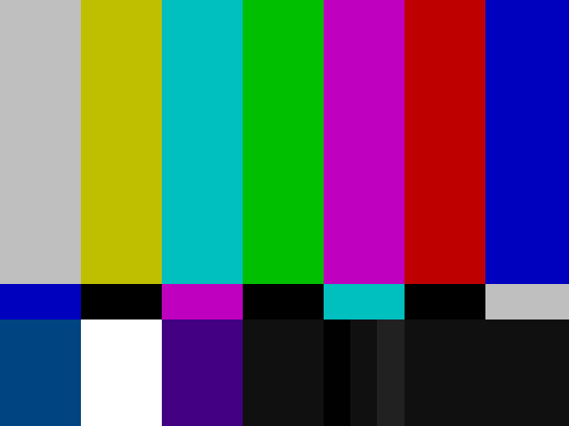
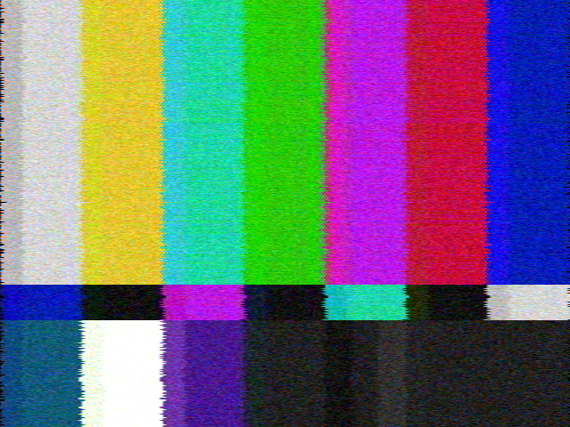

# NTSC Composite Simulator

Simulate the NTSC composite video signal encoding and decoding pipeline. Process video or images through an accurate analog signal path to reproduce the characteristic artifacts of NTSC television — color bleeding, rainbow cross-color, dot crawl, and chroma/luma bandwidth limitations.

Available in both **Python** and **Rust** — the Rust version offers significantly faster processing with identical output.

## Examples

| Source | NTSC Roundtrip | Degraded Signal |
|:---:|:---:|:---:|
|  |  |  |
| Clean SMPTE color bars | After encode/decode roundtrip | `--noise 0.05 --ghost 0.15 --attenuation 0.1 --jitter 0.5` |

## Features

- **Roundtrip** video through the full encode/decode pipeline in memory
- **Encode** video frames into a composite NTSC signal (saved as `.npy`)
- **Decode** a previously exported composite signal back into video
- **Telecine** simulation with 3:2 pulldown (24p film to 480i interlaced)
- **Image** processing through the NTSC signal path
- **SMPTE color bars** test pattern generator
- **Signal degradation effects**: noise (snow), ghosting, attenuation, horizontal jitter
- **Two comb filter modes**: horizontal 2-sample delay (default) and 1H line-delay
- Parallel frame processing (multiprocessing in Python, rayon in Rust)

## Requirements

### Python

- Python 3
- [ffmpeg](https://ffmpeg.org/) (optional, for interlaced output and audio muxing)

```bash
pip install -r requirements.txt
```

Dependencies: `numpy`, `scipy`, `opencv-python`, `tqdm`

### Rust

- Rust toolchain (1.70+)
- [ffmpeg](https://ffmpeg.org/) (for video I/O)

```bash
cd rust
cargo build --release
```

## Usage

### Python

#### Roundtrip (video through NTSC and back)

```bash
python main.py roundtrip input.mp4 -o output.mp4
```

With telecine (3:2 pulldown, interlaced 480i output):

```bash
python main.py roundtrip input.mp4 -o output.mp4 --telecine
```

#### Encode video to composite signal

```bash
python main.py encode input.mp4 -o signal.npy
```

#### Decode composite signal to video

```bash
python main.py decode signal.npy -o output.mp4 --width 640 --height 480
```

#### Process a single image

```bash
python main.py image photo.png -o ntsc_photo.png
```

#### Generate SMPTE color bars

```bash
python main.py colorbars -o colorbars.npy --save-source bars.png
```

#### Simulate weak signal reception

```bash
# Subtle snow
python main.py image photo.png -o noisy.png --noise 0.05

# Moderate degradation — all effects combined
python main.py roundtrip input.mp4 -o degraded.mp4 --noise 0.05 --ghost 0.15 --attenuation 0.1 --jitter 0.5
```

### Rust

The Rust version supports the same commands and flags. Replace `python main.py` with the compiled binary:

```bash
# From the rust/ directory after building:
./target/release/ntsc-composite-simulator roundtrip input.mp4 -o output.mp4
./target/release/ntsc-composite-simulator roundtrip input.mp4 -o output.mp4 --telecine
./target/release/ntsc-composite-simulator image photo.png -o ntsc_photo.png
./target/release/ntsc-composite-simulator colorbars -o colorbars.png --save-source source.png
```

### Options

| Flag | Commands | Description |
|---|---|---|
| `-o, --output` | all | Output file path |
| `--width` | decode, roundtrip, image | Output width (default: 640) |
| `--height` | decode, roundtrip, image | Output height (default: 480) |
| `--telecine` | roundtrip | Enable 3:2 pulldown telecine |
| `--comb-1h` | decode, roundtrip, image | Use 1H line-delay comb filter instead of 2-sample delay |
| `--crf` | decode, roundtrip | x264 CRF quality, 0=lossless, 51=worst (default: 17) |
| `--preset` | decode, roundtrip | x264 encoding preset, e.g. `ultrafast`, `fast`, `slow` (default: fast) |
| `--threads` | roundtrip | Number of worker processes (default: auto-detect) |
| `--noise` | decode, roundtrip, image | Snow amplitude (e.g. 0.05=subtle, 0.2=heavy) |
| `--ghost` | decode, roundtrip, image | Ghost amplitude 0-1 (multipath echo) |
| `--ghost-delay` | decode, roundtrip, image | Ghost delay in microseconds (default: 2.0) |
| `--attenuation` | decode, roundtrip, image | Signal attenuation 0-1 (washed-out picture) |
| `--jitter` | decode, roundtrip, image | Horizontal jitter in samples (timing instability) |
| `--signal` | image | Also export the composite signal as `.npy` (Python only) |
| `--wav` | encode, image, colorbars | Export signal as a WAV file (Python only) |
| `--save-source` | colorbars | Save the source SMPTE pattern as PNG |

Run `python main.py <command> -h` or `ntsc-composite-simulator <command> -h` for full details.

## How It Works

### Encoding

1. Convert RGB to YIQ color space
2. Bandwidth-limit luma (4.2 MHz), I (1.5 MHz), and Q (0.5 MHz) channels with FIR filters
3. Modulate I/Q onto the 3.58 MHz color subcarrier
4. Build the full 525-line NTSC frame structure with sync, blanking, and colorburst
5. Apply vestigial sideband filtering

### Decoding

1. Separate luma and chroma using a comb filter
2. Detect burst phase from the colorburst reference
3. Demodulate I and Q via product detection
4. Low-pass filter the recovered chroma channels
5. Convert YIQ back to RGB

### Signal Specifications

| Parameter | Value |
|---|---|
| Sample rate | 14,318,180 Hz (4 x F_SC) |
| Color subcarrier | 3,579,545 Hz |
| Frame rate | 29.97 fps |
| Lines per frame | 525 (480 visible) |
| Samples per line | 910 |

## Comb Filter Modes

- **2-sample delay** (default): Cancels chroma from luma using a horizontal delay. Can produce rainbow cross-color on sharp edges.
- **1H line-delay** (`--comb-1h`): Uses the adjacent line from the same field. Reduces rainbow artifacts but introduces hanging-dot patterns on horizontal color transitions as well as some line doubling.
